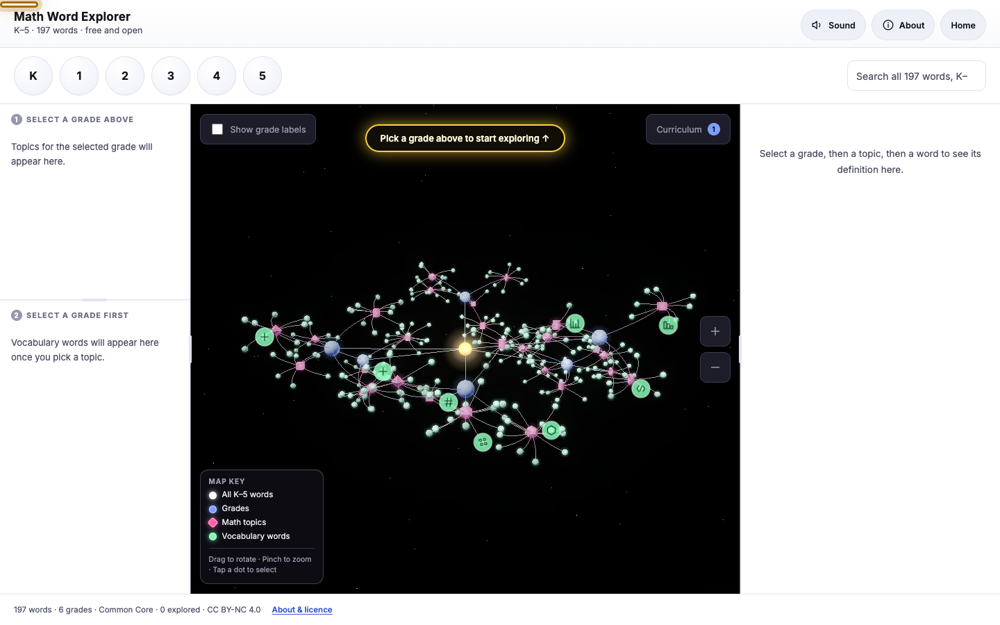

# Math Word Explorer

**A free tool that explains the math words children meet from Kindergarten to
Grade 5 — in language they can actually read — cited to three national
mathematics curricula: the US Common Core, the UK National Curriculum, and
India's NCERT.**



Word problems are often hard for a reason that has nothing to do with the
maths. They are full of words like *denominator*, *perimeter* and *regroup*. A
child can know how to subtract and still be stuck, simply because they are not
sure what *how many are left* is asking.

This tool explains every one of those words twice over: once as a short, plain
definition, and once as a small story showing the word doing its job in a real
situation. By default it shows the 223 words cited to the US Common Core State
Standards for Mathematics; a **Curriculum** control above the 3D graph lets a
reader add the UK National Curriculum and India's NCERT syllabus, bringing the
bank to 264 words across all three.

Free, open source, and it collects no data about anyone.

---

## Contents

- [Try it](#try-it)
- [Who it is for](#who-it-is-for)
- [What you get for every word](#what-you-get-for-every-word)
- [The curricula](#the-curricula)
- [The knowledge graph](#the-knowledge-graph)
- [Run it on your own computer](#run-it-on-your-own-computer)
- [Turning on the read-aloud voice](#turning-on-the-read-aloud-voice)
- [Putting it online](#putting-it-online)
- [Editing the words](#editing-the-words)
- [How the project is put together](#how-the-project-is-put-together)
- [Accessibility](#accessibility)
- [Privacy](#privacy)
- [Credits and licence](#credits-and-licence)

---

## Try it

Open `index.html` in any browser. That is the welcome page; the **Open the
Explorer** button takes you into the tool itself (`app.html`).

Nothing to install and no sign-in. It works on a tablet, laptop or any
browser — on a phone screen, the Explorer suggests switching to a larger
device rather than opening into a cramped layout.

**How a child uses it — three steps:**

1. **Choose a grade** along the top.
2. **Select a topic** on the left (grouped by the standard's own domains —
   Operations & Algebraic Thinking, Geometry, and so on).
3. **Select a vocabulary word** — its explanation appears on the right.

The 3D map in the middle shows where that word sits among all the others. You
can spin it by dragging, and tapping any dot in it jumps straight to that
word.

---

## Who it is for

| Who | How they use it |
| --- | --- |
| **Children** | Look a word up on their own. Big buttons, a read-aloud button, and a tick beside every word already explored. |
| **Teachers** | Put a new word on the board, or let children look words up during independent work. Words are grouped by grade and topic and cited to their standard — Common Core by default, UK and India a tap away. |
| **Tutors** | Quickly tell whether a child is stuck on the vocabulary or on the method. |
| **Parents and carers** | Help with homework without needing to remember the maths yourself — the explanation is written for both of you. |

---

## What you get for every word

Each word has four parts:

- **What it means** — a plain definition, one or two short sentences.
- **See it in an example** — a short story with a named child and a real
  situation, showing the word being used.
- **Watch out for** — the mistake children usually make with this word.
- **Listen** — a button that reads the whole thing aloud.

Every entry is also cited to the standard(s) it comes from, shown as small
badges next to the word — a word sourced from more than one curriculum (say,
one both the US and India teach) carries a badge for each.

Here is one entry, as a child sees it:

> ### denominator
> **US · 3.NF.A.1**
>
> **What it means** — The bottom number. It tells how many equal parts make the whole.
>
> **See it in an example** — Maya writes 3/8. The denominator 8 means the whole pie was cut into 8 equal parts.

**Every explanation is checked for reading difficulty when the site is built.**
The build prints a Flesch report, so the language stays within reach of the age
it is written for instead of quietly drifting harder over time. The current
bank averages a Flesch Reading Ease in the high 80s ("very easy" to "easy")
and a Flesch-Kincaid grade level of about 3, using the method of Flesch (1948)
as later adapted into the grade-level form by Kincaid et al. (1975).[^flesch]

[^flesch]: Flesch, R. (1948). *A new readability yardstick.* Journal of
    Applied Psychology, 32(3), 221–233. Kincaid, J. P., Fishburne, R. P.,
    Rogers, R. L., & Chissom, B. S. (1975). *Derivation of new readability
    formulas for Navy enlisted personnel.* Research Branch Report 8-75, Naval
    Air Station Memphis. Implemented locally in `readability.py`.

---

## The curricula

The bank started as a single-country resource — 189 words, entirely US Common
Core. A full audit against the UK and Indian curricula found real gaps in
both directions: concepts the UK and India teach that Common Core does not
name until a later grade or not at all (a circle's radius, the Indian
place-value units *lakh* and *crore*, percentage), and — separately — genuine
Common Core vocabulary the original 189 had simply missed. That audit is what
the 49 internationally-sourced additions and the **Curriculum** picker are
built from.

| Country | Standard | Publisher | Citation |
| --- | --- | --- | --- |
| 🇺🇸 United States | Common Core State Standards for Mathematics | National Governors Association Center for Best Practices & Council of Chief State School Officers | National Governors Association Center for Best Practices, & Council of Chief State School Officers. (2010). *Common Core State Standards for Mathematics.* Washington, DC. <http://www.corestandards.org/Math/> |
| 🇬🇧 United Kingdom | Mathematics programmes of study: key stages 1 and 2, National Curriculum in England | Department for Education | Department for Education. (2013, updated 2021). *Mathematics programmes of study: key stages 1 and 2 — National curriculum in England.* <https://assets.publishing.service.gov.uk/media/5a7da548ed915d2ac884cb07/PRIMARY_national_curriculum_-_Mathematics_220714.pdf>. Terminology cross-checked against National Centre for Excellence in the Teaching of Mathematics. (2014). *Mathematics glossary for teachers in key stages 1 to 3.* <https://www.ncetm.org.uk/media/hpihrj3s/national-curriculum-glossary.pdf> |
| 🇮🇳 India | Learning Outcomes, Classes I–V Mathematics, National Curriculum Framework | National Council of Educational Research and Training (NCERT) | National Council of Educational Research and Training. (2017, coded edition 2021). *Coded Learning Outcomes, Classes I–X.* Directorate of Educational Research and Training, Meghalaya. Cited in this bank by class and outcome number, e.g. `Class III · 3.M.LO4.2` |

Every internationally-sourced word names its exact citation — a US entry
shows the standard code (`4.OA.B.4`), a UK entry shows the Year group and
source document, an India entry shows the class and Learning Outcome number.
Where the UK or India does not use a code as granular as Common Core's, the
citation says so rather than inventing one.

**What is not covered yet.** India's NCERT curriculum is numbered from Class I
(roughly age 6), so there is no India citation for Kindergarten-level content.
Singapore's MOE syllabus, Japan's MEXT Course of Study, and Australia's
national curriculum are natural next additions and use the same kind of
citable, numbered standards — not yet included, but the data model (a list of
`{country, code}` citations per word, see [Editing the
words](#editing-the-words)) already supports adding them.

---

## The knowledge graph

The centre of the 3D map is
["Sun"](https://skfb.ly/6yGSx) by SebastianSosnowski, used under
[CC BY 4.0](http://creativecommons.org/licenses/by/4.0/) — see
[Credits and licence](#credits-and-licence) for the full attribution. It turns
slowly on its own axis, independent of the camera's own orbit, with a warm
corona from the same bloom pass that gives every other node its glow. The
choice is not just decorative: every grade, topic and word in the bank orbits
that one centre, the same way the graph itself is meant to read as a small
constellation — mathematics as one connected structure rather than 238
unrelated facts to memorise.

Turning on **Show grade labels** (top-left of the graph) also reveals the
centre's own label, the live word count for whichever curricula are
currently selected.

---

## Run it on your own computer

You only need this if you want to change something. To simply *use* the tool,
open `index.html`.

**What you need:** Python 3 and Node.js (version 18 or newer).

```bash
npm install
```

```bash
npm run build
```

```bash
npm start
```

Then open <http://localhost:4173>.

`npm run build` regenerates everything: the word data, the Markdown copies,
and the two HTML pages. Run it after any change to the words or the code.

---

## Turning on the read-aloud voice

The **Listen to an explanation** button uses [Fish Audio](https://fish.audio)
for speech. It needs an API key, and that key must never go in the page itself —
this is a public site, so anything in the page is visible to everybody. Instead
the key lives on the server, and the page asks the server to do the talking.

**If you see "Could not load audio: Voice server is missing FISH_API_KEY"**,
that is not a bug. It is the server telling you no key is set up yet. Set one:

1. Copy `.env.example` to `.env.local`.
2. Put your Fish Audio key in it as `FISH_API_KEY=...`.
3. Restart the server (`npm start`) — the file is only read at startup.

To check what is happening, call the endpoint directly:

```bash
curl -s -X POST http://127.0.0.1:4173/api/tts -H 'Content-Type: application/json' -d '{"text":"hello"}'
```

| What comes back | What it means |
| --- | --- |
| `missing FISH_API_KEY` | No key is set up. |
| `Fish Audio returned an error (401)` | A key is set, but Fish Audio rejected it. |
| Binary gibberish | It is working. |

Everything else in the tool works fine without a key. Only the Listen button
needs it.

---

## Putting it online

The site is two plain HTML files plus a small `assets/` folder, so almost any
static host will do.

**On Vercel** (what this project uses):

1. Connect the GitHub repo to a new Vercel project.
2. Use the **Other** framework preset. The repository's `vercel.json` runs
   `npm run build` and deploys the generated `public/` directory.
3. Under **Settings → Environment Variables**, add `FISH_API_KEY` and
   `FISH_VOICE_ID`. Tick all three environments.
4. **Redeploy.** Environment variables are only picked up at deploy time, so an
   existing deployment keeps saying "missing FISH_API_KEY" until you redeploy.

Vercel turns `api/tts.js` into the server-side function automatically.
`.vercelignore` keeps `.env*` out of the upload, and `public/` — rebuilt by
`npm run build`, and gitignored so nothing stale is ever committed there —
contains the two self-contained HTML files, `assets/sun.glb`, and
`roadmap.html`, all served statically.

> **Before you make the URL public**, read
> [Cost and abuse](#cost-and-abuse) below. The voice endpoint currently accepts
> any text from anybody, which is fine for a private link and risky for a public
> one.

### Cost and abuse

`/api/tts` accepts arbitrary text (up to 2,000 characters) from anyone, with
`Access-Control-Allow-Origin: *`. Once the address is public, anyone who finds
it has a free text-to-speech API billed to your Fish Audio account.

Fixes, cheapest first:

1. Set `CORS_ORIGIN` to your real site address instead of leaving it `*`.
2. Add rate limiting (Vercel firewall rules, or Cloudflare on the Worker route).
3. **The durable fix:** make the endpoint take a word id (`{"termId":
   "k-cc-count"}`) instead of free text, and build the sentence server-side from
   `vocab_data.json`. It could then only ever say one of a fixed set of things,
   which also makes the audio cacheable and nearly free. This needs changes in
   `server.js`, `api/tts.js`, `fish-audio-worker.js` and `src/tts.js`.

Also prefer a key limited to the free `s2.1-pro-free` model, so a leak cannot
run up a bill.

---

## Editing the words

**All words live in one place: the `DATA` table at the top of
`build_data.py`.** Most entries are four pieces of text — a Common Core word,
whose one standard is derived automatically from its grade and domain:

```python
("denominator",
 "The bottom number. It tells how many equal parts make the whole.",
 "Maya writes 3/8. The denominator 8 means the whole pie was cut into 8 equal parts.",
 ""),   # <- the "watch out for" note, or "" if there isn't one
```

A word sourced from the UK or India (or cited to more than one curriculum at
once) adds a fifth element: a list of `(country, code)` citations, which
replaces the automatic Common Core derivation entirely.

```python
("cuboid",
 "A solid, box-like shape with 6 flat, rectangle faces.",
 "Theo stacks a tissue box on the shelf. It has 6 flat sides shaped like rectangles. It is a cuboid.",
 "A cuboid can be tall, short, or a cube. As long as it has 6 rectangle faces, it counts.",
 [("UK", "Y1 · KS1 glossary"), ("IN", "Class II · 2.M.LO2.1")]),
```

Change either shape, then run `npm run build`. That rewrites
`vocab_data.json`, the Markdown files in `vocab_bank/`, and both HTML pages.
The curriculum picker, the standard badges, and every count in the app read
straight from this data — there is nothing else to update by hand.

**Writing guidance** (also at the top of `build_data.py`):

- Keep sentences short. Sentence length matters more for readability than
  anything else.
- Use everyday words *around* the hard word. "Denominator" is five syllables and
  cannot be avoided; everything else in the sentence can be one or two.
- Examples should be *situated*: a named child, a real setting, and the thinking
  made visible. There is a small recurring cast (Maya, Leo, Ana, Ben, Ivy, Zoe,
  Theo, Nina, Omar, Sam) so the bank reads as one world.
- Name the mistake children actually make, not the abstract error.
- Avoid a term whose *name* ends in punctuation (`"A.M. and P.M."`) — the
  narration script appends its own sentence-ending period right after the
  term, and the collision reads as a typo out loud. `tests/narration.test.js`
  catches this at test time; write around it instead.

The build prints a readability report and flags anything that drifted too hard.

---

## How the project is put together

The two HTML files are **built**, not hand-edited. Edit the sources, then run
the build.

```
build_data.py         the words + the writing guidance             <- edit words here
readability.py        the Flesch reading-level checker
build_html.py         assembles the two HTML pages, copies assets

src/                  the app's source                             <- edit code here
  styles.css             layout, theme, responsive rules
  landing.css             the welcome page's styles
  constants.js            grades, domains, curricula, shared helpers
  icons.js                the SVG icon set
  sound.js                interaction sounds
  graph3d.js               the 3D map (Three.js) — nodes, the sun model, bloom
  narration.js             story-like scripts for Fish Audio
  ui.js                    panels, keyboard support, announcements
  tts.js                   the Listen button
  about.js                 the About dialog
  curriculum.js            the Curriculum picker
  panelResize.js           draggable panel splitters
  main.js                  app state and wiring

landing_template.html  page shell for the welcome page
app_template.html      page shell for the tool

index.html            BUILT - the welcome page
app.html              BUILT - the tool
vocab_data.json       BUILT - the word data, with standards citations
vocab_bank/*.md       BUILT - one readable Markdown file per grade

assets/sun.glb        the root node's 3D model (see Credits)
docs/screenshot.png   the screenshot at the top of this file

server.js             local web server + voice proxy
api/tts.js             the same voice proxy, for Vercel
fish-audio-worker.js  the same voice proxy, for Cloudflare
tests/                Node tests for generated narration
```

`index.html` and `app.html` are each a single self-contained file with all the
CSS and JavaScript inlined. That means you can email one to a teacher, put it on
a USB stick, or drop it on any static host, and it just works — with one
exception, noted below.

**What loads from the internet:** the 3D map uses Three.js, GSAP, and
Three.js's GLTFLoader from a CDN, plus the sun model itself
(`assets/sun.glb`, ~2 MB) from wherever the page is hosted. If any of those
cannot load — no internet, a school firewall, the model file is missing —
the graph falls back gracefully: no Three.js means a text message and
*everything else keeps working* (the words, definitions, examples, search,
sounds, About dialog); no sun model means the plain white sphere it replaces.
This is tested.

**Why the sun model is not inlined.** Every font and every script in this
project is base64-inlined into the single HTML file — the established
pattern here (`bundle_inter_fonts()` in `build_html.py`). The sun model is
~2 MB, too large to inline in the same way without meaningfully bloating a
page whose whole selling point is opening instantly on a school network; it
is instead fetched once, lazily, the same resilient way Three.js and GSAP
already are.

**Performance.** The map is built once as a fixed structure — every grade,
topic and word, drawn with instancing and a single merged line object, about
a dozen draw calls rather than hundreds — and the **Curriculum** picker never
touches that structure. Switching curricula on or off fades the relevant
nodes in and out through the same per-frame highlight blend the selection
system already uses, instead of rebuilding the WebGL scene, which is what
keeps it smooth on a school iPad even while the picker is being used.

**Sounds.** Clicking makes a small sound that tells you *what* happened — a warm
swell for a grade, a downward drop for a topic, a bright chime for a word, a
paper flick for going back. They are synthesized live by
[cuelume](https://github.com/Danilaa1/cuelume), so there are no audio files to
download and they work offline. The Listen button is deliberately silent, so
nothing steps on the first word of the speech. **Sound can be turned off with
the button in the header**, and the choice is remembered.

---

## Accessibility

Built to WCAG 2.1 AA.

- **Keyboard** — every grade, topic, word, and curriculum checkbox is a real
  control. `Tab` moves between groups; arrow keys (and `Home`/`End`) move
  within a list; `Enter` or `Space` selects; `Escape` closes the Curriculum
  and About popovers.
- **Screen readers** — choosing a word reads out the word, its meaning and its
  example, because the explanation appears far from the list you are using.
  Switching curricula announces which ones are now active.
- **Zoom** — pinch-to-zoom works. Nothing blocks it.
- **Contrast** — all text is at least 5:1 against its background.
- **Touch targets** — every button is at least 44px tall.
- **Reduced motion** — with the system "Reduce Motion" setting on, the map stops
  spinning, the sun stops turning, camera moves become instant, and animations
  are switched off.
- **Colour is never the only signal** — each Common Core domain also has its own
  3D shape and its own icon; each curriculum also has its own flag and code.

---

## Privacy

**This site collects no data at all.** No sign-in, no analytics, no cookies, no
advertising, no tracking of any kind. Nothing about a child is sent anywhere or
stored on any server.

Three things are saved on your own device, in your own browser: which words
have been opened, whether sound is on, and which curricula are selected.
Clearing your browser data erases all three.

The one time anything leaves your device is when you press **Listen** — the
sentence to be spoken is sent to the voice server so it can be turned into
audio. Nothing is stored.

---

## Credits and licence

Made by the **Usable Math** team at the University of Massachusetts Amherst
([usablemath.org](https://usablemath.org)), with the **Society & AI** research
group ([societyandai.org](https://societyandai.org)).

Released as an Open Educational Resource under
[CC BY-NC 4.0](https://creativecommons.org/licenses/by-nc/4.0/) — share it and
adapt it for non-commercial use, with credit.

Source: [github.com/sai-educ/math-vocab](https://github.com/sai-educ/math-vocab)

**Curriculum standards** — see [The curricula](#the-curricula) for full
citations to the US Common Core State Standards, the UK Department for
Education's National Curriculum (with terminology from the NCETM's
Mathematics glossary for teachers), and India's NCERT Coded Learning
Outcomes.

**3D assets** — the knowledge graph's centre is "Sun"
(<https://skfb.ly/6yGSx>) by SebastianSosnowski, licensed under
[Creative Commons Attribution 4.0](http://creativecommons.org/licenses/by/4.0/).

**Software** — [Three.js](https://threejs.org) and [GSAP](https://gsap.com)
for the 3D map, [cuelume](https://github.com/Danilaa1/cuelume) (MIT) for the
sounds, and the [Inter](https://rsms.me/inter/) typeface (SIL Open Font
Licence 1.1).
